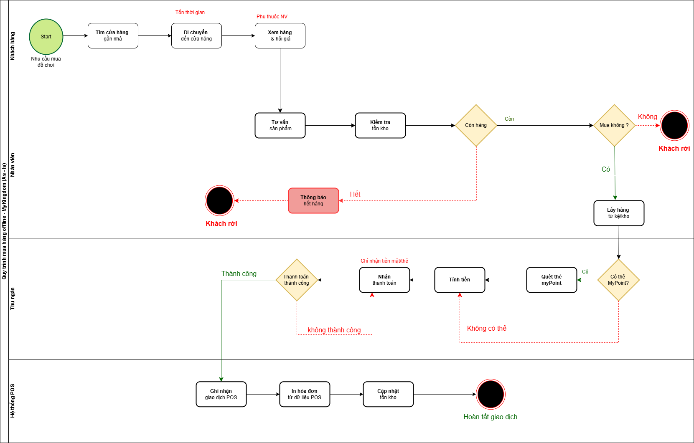
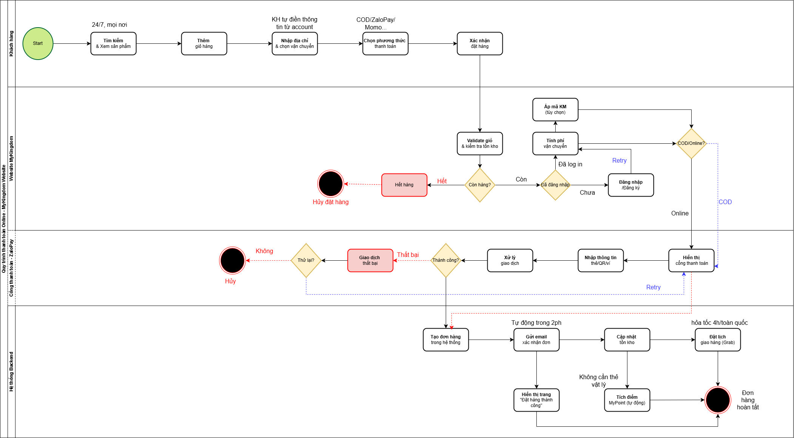

# BPMN Swimlane Diagrams

This folder contains the BPMN Swimlane Diagrams used to analyze and redesign the MyKingdom purchasing process.

## As-Is Process

The current-state purchasing workflow performed at physical MyKingdom stores.

## To-Be Process

The future-state e-commerce workflow designed to support online purchasing, payment, order tracking, and loyalty point integration.

## Objective

These diagrams were created to:

- Identify pain points in the existing process.
- Analyze business process gaps.
- Design an optimized future-state process.
- Support Business Requirements (BR) and Software Requirements (SRS) definition.
